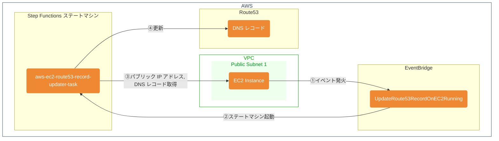

# aws-ec2-route53-record-updater

EC2 インスタンス起動時にパブリック IP アドレスを取得し、Route 53 のレコードを更新します。

## 概要

1. EC2 インスタンスが起動すると、EventBridge のイベントルールから Step Functions ステートマシンが起動します。
2. Step Functions ステートマシンは、EC2 インスタンスのパブリック IP アドレスを取得し、Route 53 のレコードを更新します。



## デプロイ

### 準備: CloudWatch Logs の Resource based policy 更新

- [cloudwatch-logs-resource-policy.md](cloudwatch-logs-resource-policy.md) を参照して、 `cloudwatch-logs-resource-policy.json` を編集して、 CloudWatch Logs の Resource based policy を更新する。

### デプロイ

`ROUTE53_HOSTED_ZONE_ID` に設定する DNS レコードのホストゾーン ID を指定して Serverless Framework でデプロイします。

```bash
npm install
ROUTE53_HOSTED_ZONE_ID=Z******************** npx serverless deploy --region us-east-1
```

### EC2 インスタンスへのタグの設定

Route 53 に登録する DNS レコード名を EC2 インスタンスのタグに設定します。

```json
{
    "Key": "Route53Record",
    "Value": "hogehoge.example.com"
}
```

※このタグキー (デフォルトでは `Route53Record`) はデプロイ時に `domainNameTagKey` で指定した値を指定します。デプロイ時にこのキーを変更するには `--param="domainNameTagKey=新しいタグキー"` オプションを指定します。（参考: [Serverless Framework - Parameters](https://www.serverless.com/framework/docs-guides-parameters)）
